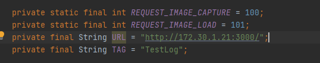

# Get Menu
## Server
### Requirements
- python
- pip
- tesseract

### Installation
Installing package
```bash
pip install pillow
pip install pytesseract
pip install opencv-python
pip install matplotlib
pip install googletrans==4.0.0-rc1
```

Starting server
```bash
npm start
```

## Android
### Set server url
android\app\src\main\java\com\example\getmenu\SelectPicture.java

